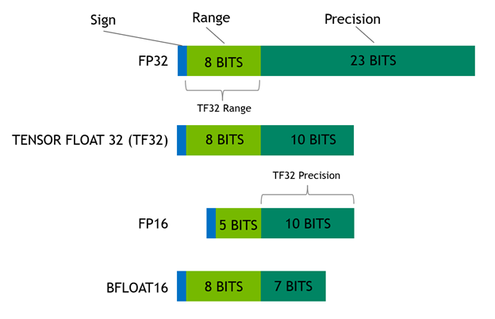

# recode-with-mistral-finetune

`mistral-finetune` is a light-weight codebase that enables memory-efficient and performant finetuning of Mistral's models.
It is based on [LoRA](https://arxiv.org/abs/2106.09685), a training paradigm where most weights are frozen and only 1-2% of additional weights in the form of low-rank matrix perturbations are trained. 

This repo is a fork of the original [`mistral-finetune` ](https://github.com/mistralai/mistral-finetune) adapted to the training of models dedicated to ICD-10 coding from clinical notes.

The purpurse of this fork is to help information medical teams to finetune Mistral model on the ICD-10 coding task (in french) with so called annotated data :
- data = clinical notes (1 note or the concatenation of all the notes available for the patient in EMR). The restriction is that the model can only take a fixed number of token as entry.
- annotation = ICD-10 codes of the PMSI resume. 2 formats are possible
  * when using classification : lits of code (ex [C509, I10,...])
  * when using generative model : definition of the code (code) (ex : Hypertention artérielle primitive (I10)).

For this finetuning a generative model we can use 2 paradigm :
- Next token prediction : you give the model a long text, and the task is to prodict next word. For ICD-10 coding, we train the model will on a text which is the concatenation of the note and ICD-10 coding. This task will princilally help the model to learn contextualised reprensentations of medical words of the clinical note and of the of ICD-10 definitions and codes/ 
- Instruction prediction : the model here is seen as an assistant. You give to the assistant a context (medical ICD-10 coding from clinical notes) and a question (what codes will you choose for the following clinical note), and the assistant will give a correct answer (the ICD-10 codes).

The project contains 3 notebooks (```tutorials/```):
- <a target="_blank" href="https://github.com/24p11/recode-with-mistral-finetune/blob/main/tutorials/generate_fictives_notes.ipynb">
   </a> generate_fictives_notes.ipynb : Some fictional sample data (annoted clinical notes with ICD-10 codes) have been generated with [Mistral AI API](https://docs.mistral.ai/api/)  
- <a target="_blank" href="https://github.com/24p11/recode-with-mistral-finetune/blob/main/tutorials/prepare_data_for_generative_finetuning.ipynb">
   </a> prepare_data_for_generative_finetuning.ipynb : prepare data for training 
- <a target="_blank" href="https://github.com/24p11/recode-with-mistral-finetune/blob/main/tutorials/mistral_finetune_7b.ipynb"></a> mistral_finetune_7b.ipynb : execute training and perform eveluation with model Mistral-7B 


## Prepare dataset 

To ensure effective training, `mistral-finetune` has strict 
requirements for how the training data has to be formatted.

All data files must be stored in jsonl format files.

You can build two types of data files:

### _Pretrain_:

Pretrain data corresponds to plain text data stored in the `"text"` key. E.g:

```jsonl
{"text": "Text contained in clinical note n°1. ICD-10 codes : definition 1 (code 1),..."}
{"text": "Text contained in clinical note n°2. ICD-10 codes : definition 1 (code 1),..."}
```

In the pretrain paradigm models are funetune with the next token prediction task.
### _Instruct_:

Currently two different types of instruction following data are supported:

- _Instruct_: In the conversational data stored in the `"messages"` key in the form of a list. Each list item is a dictionary containing the `"content"` and `"role"` keys. `"role"` is a string being one of 
  * "system" :  task contextualization
  * "user" : question the assistant will answer
  * "assistant" : expected result from the assistant
The loss will only be computed if "role" == "assistant". 

For ICD-10 coding in French we have adopted the following conventions :
- system : Vous êtes un modèle de langage en française spécialisé dans le codage des diagnostics selon la classification internationale des maladies version 10 (CIM-10) pour les résumés standardisés de sortie du programme de médicalisation des systèmes d'information français (PMSI). A partir des comptes rendus d'hospitalisation vous donnerez les codes diagnostics CIM-10 que l'on peut retenir pour le séjours en distiguant diagnostic principal, diagnostic relié et diagnostics associés.
- user : Générez le codage CIM-10 du résumé strandisé de sortie PMSI à partir du compte rendu d'hospitalisation suivant : texte du compte rendu
- assistant : Codes CIM 10 retenus pour le résumé strandisé de sortie PMSI : diagnostic principal : définition du code (code), diagnistic relié : aucun, diagnostic associé : définition diagnostic 1 (code 1),...
```jsonl
{
  "messages": [
     {
      "role": "system",
      "content": "Vous êtes un modèle de langage en française spécialisé dans le codage des diagnostics selon la classification internationale des maladies version 10 (CIM-10) pour les résumés standardisés de sortie du programme de médicalisation des systèmes d'information français (PMSI). A partir des comptes rendus d'hospitalisation vous donnerez les codes diagnostics CIM-10 que l'on peut retenir pour le séjours en distiguant diagnostic principal, diagnostic relié et diagnostics associés."
    },
    {
      "role": "user",
      "content": "Générez le codage CIM-10 du résumé strandisé de sortie PMSI à partir du compte rendu d'hospitalisation suivant : texte du compte rendu n°1"
    },
    {
      "role": "assistant",
      "content": "Codes CIM 10 retenus pour le résumé strandisé de sortie PMSI : diagnostic principal : définition du code (code), diagnistic relié : aucun, diagnostic associé : définition diagnostic 1 (code 1),..."
    }
  ]
}
{
  "messages": [
     {
      "role": "system",
      "content": "Vous êtes un modèle de langage en française spécialisé dans le codage des diagnostics selon la classification internationale des maladies version 10 (CIM-10) pour les résumés standardisés de sortie du programme de médicalisation des systèmes d'information français (PMSI). A partir des comptes rendus d'hospitalisation vous donnerez les codes diagnostics CIM-10 que l'on peut retenir pour le séjours en distiguant diagnostic principal, diagnostic relié et diagnostics associés."
    },
    {
      "role": "user",
      "content": "Générez le codage CIM-10 du résumé strandisé de sortie PMSI à partir du compte rendu d'hospitalisation suivant : texte du compte rendu n°2"
    },
    {
      "role": "assistant",
      "content": "Codes CIM 10 retenus pour le résumé strandisé de sortie PMSI : diagnostic principal : définition du code (code), diagnistic relié : aucun, diagnostic associé : définition diagnostic 1 (code 1),..."
    }
  ]
}
```


 The notebook ```prepare_data_for_generative_finetuning```  will show how to prepare data step by step. <a target="_blank" href="https://github.com/24p11/recode-with-mistral-finetune/blob/main/tutorials/prepare_data_for_generative_finetuning.ipynb">
   </a>


## Verify dataset

Before starting a training run you should verify that your dataset is correctly formatted and get an 
estimation of the training time. You can do so by using the [./utils/validate_data](https://github.com/mistralai/mistral-finetune/blob/main/utils/validate_data.py) script.

Note that this step is crucial to ensure that the data is correctly formatted.

```
cd $HOME/mistral-finetune
python -m utils.validate_data --train_yaml example/7B.yaml
```

You should get a summary of the data input and training parameters:

```
Train States
 --------------------
{
   "expected": {
       "eta": "00:52:44",
       "data_tokens": 25169147,
       "train_tokens": 131072000,
       "epochs": "5.21",
       "max_steps": 500,
       "data_tokens_per_dataset": {
           "/Users/johndoe/data/ultrachat_chunk_train.jsonl": "25169147.0"
       },
       "train_tokens_per_dataset": {
           "/Users/johndoe/data/ultrachat_chunk_train.jsonl": "131072000.0"
       },
       "epochs_per_dataset": {
           "/Users/johndoe/data/ultrachat_chunk_train.jsonl": "5.2"
       }
   },
}
```

Having `max_steps` set to 500 would lead to iterating through the dataset roughly 5 times which is reasonable, but might 
be a bit too much. A recommended setting is shown below which would only take 30min on a 8xH100 cluster.

See notebook mistral_finetune_7b <a target="_blank" href="https://github.com/24p11/recode-with-mistral-finetune/blob/main/tutorials/mistral_finetune_7b.ipynb"></a>


## Training
The train is performed with the train script with a simple command line :
```
cd mistral-finetune
torchrun --nproc-per-node 1 -m train example/instruct_icd_v1.yaml
```

The notobook mistral_finetune_7b gives you a full example <a target="_blank" href="https://github.com/24p11/recode-with-mistral-finetune/blob/main/tutorials/mistral_finetune_7b.ipynb"></a>

All the parameters of the training procedure are stored in yaml config file (see example/7B.yaml). Modify your training yaml to include the ultrachat dataset and verify the yaml

The example `mistral-finetune/examples/7B` defines reasonable parameters for learning rate, weight decay, etc... but you are advised to 
customize these settings for your use case.

Generally, a training configuration should fill the following parameters:

- `model_id_or_path` defines the model to start training from. This can be a path to a pre-trained model or a local model directory.
- `run_dir` defines the directory where training checkpoints and metrics are stored.
- `seq_len` defines the sequence length for training. This is the maximum length of input sequences the model will process. Samples are packed to reach a length of `seq_len` for maximum training efficiency.
- `batch_size` defines the number of training examples used per GPU. **Note**: The overall effective batch_size (in tokens) across all GPUs equals `num_gpus` x `batch_size` x `seq_len`.
- `max_steps` defines the maximum number of training steps. This is the total number of iterations the training process will run. It can be adjusted based on the specific needs of your training scenario. Total number of tokens seen during training is `max_steps` x `num_gpus` x `batch_size` x `seq_len`.
- `optim.lr` defines the learning rate. This is the initial learning rate for the optimizer.
- `optim.weight_decay` defines weight decay. Weight decay is a regularization technique used to prevent overfitting by penalizing large weights. We recommend leaving it at 0.1.
- `optim.pct_start` defines the percentage of the total training steps used for the learning rate warm-up phase before it starts to decrease. It corresponds to pct_start of PyTorch's OneCycleLR.
- `lora.rank` defines the size of the LoRA (Low-Rank Adaptation) adapters. We recommend 64 or less, which adjusts the rank of the low-rank decomposition used in LoRA.
- `seed` defines the random seed for initialization and data shuffling/sampling. Setting a seed ensures reproducibility of results.
- `log_freq` defines the logging frequency. This specifies how often (in steps) to log training metrics.
- `data.instruct_data` is the path to the instruction data used for training. This field has to be filled with one or multiple data sources in the format as explained above. Each data source should either be a path to a jsonl file or a path to a directory containing jsonl files followed by a weighting to define the importance of this dataset: `<path/to/data_source>:<weight>`. E.g.: `data.instruct_data: "/path/to/data1.jsonl:5.,/path/to/data2.jsonl:1.,/path/to/dir_of_jsonls:1."`
- `data.data` is an optional path to additional pretraining data in the format as explained above. Note that this field can be left blank.
- `data.eval_instruct_data` is an optional path to evaluation instruction data to run cross-validation at every `eval_freq` steps. Cross-validation metrics are displayed as `loss` and `perplexity`.
- `eval_freq` defines how often (in steps) to evaluate the model. This specifies the interval at which the model is evaluated on the validation set.
- `no_eval` is a flag to enable or disable intermediate evaluation. Setting it to False enables periodic evaluation during training.
- `ckpt_freq` defines how often (in steps) to save checkpoints. This specifies the interval at which the model's state is saved.
- `save_adapters` defines whether to only save the trained LoRA checkpoints or whether the trained LoRA should directly be merged into the base model and saved. **Note**: When setting `save_adapters=False` make sure that you have enough CPU and GPU memory to save the full model on a single process (this is usually only possible for the 7B model).
- `wandb.key` is used to pass your Weights & Biases (wandb) API key for logging. This allows you to log training metrics to the wandb dashboard.
- `wandb.project` defines the wandb project name. This is where the training run will be logged in the wandb interface.


## Inference

Once your model is trained, you should try it out in inference. We recommend using [mistral-inference](https://github.com/mistralai/mistral-inference). 

See mistral_finetune_7b gives you a full example <a target="_blank" href="https://github.com/24p11/recode-with-mistral-finetune/blob/main/tutorials/mistral_finetune_7b.ipynb"></a>

## Parameters optimisation

**Mixed precision**

Models are mainly a dictionary of parameters (a lots 7 Billions in our example). 
Parameters are numeric values stored in a specific format, usually numpy float32 which uses a lot of GPU memory. 
Some other format can be used (See : [NVIDIA blog](https://developer.nvidia.com/blog/getting-immediate-speedups-with-a100-tf32/))

</a>

For our training, the format to use is hard coded in the ```train.py``` file, line 175
- bflot16 and tf32 can be use with novel GPU ampere format (A100, H100)
- float16 is use instead (with GPU V100 for example)

If you have a non ampere GPU you will also need to change precision for inference (see mistral_finetune_7b.ipynb)

**Learning rate**

By default the training is configure to use [OneCycleLR](https://pytorch.org/docs/stable/generated/torch.optim.lr_scheduler.OneCycleLR.html) scheduler which as 2 period
- increase : begin with LR (initial_lr) = max_lr/div_factor to reach  LR = max_lr
- decrease : when reach  LR = max_lr decrease to  min_lr = initial_lr/final_div_factor
Mistral recommandation for max_lr is 1.e-4.
I have only experience long training with float16. With this format, the training is more instable and which have for consequence to increase the loos greatly, until sometimes an NA value (see annexe).
I recommand to use the following values when training is performed with flaot16 (not implemented in the actual config file):
- optim:
  * lr: 1.e-5
  * div_factor : 5
  * final_div_factor : 10
  * pct_start: 0.3


**Batching strategy for training data**
The load_dataset functions of mistral-fine, use by default a full in memory loading of the data which can cause memory errors for large dataset.
I recommand to set to ```False``` this option in the data Args file (/finetune/data/args.py) : 
- line 11 :  shuffle: bool = False
- line 11 :  dynamic_chunk_fn_call: bool = False
This wil force lazy loading, more adapted for large datasets.

## Annexe :

Log high LR : when LR increase, LOOS increase to nan value 

```
2024-12-19 09:24:38 (CET) - 0:03:12 - train - INFO - step: 000001 - done (%): 0.0 - loss: 1.724 - lr: 4.0e-06 - peak_alloc_mem (GB): 26.1 - alloc_mem (GB): 17.9 - words_per_second: 1167.7 - avg_words_per_second: 1167.7 - ETA: >2024-12-31 06:50:16
2024-12-19 09:26:15 (CET) - 0:04:48 - train - INFO - step: 000002 - done (%): 0.0 - loss: 1.682 - lr: 4.0e-06 - peak_alloc_mem (GB): 27.3 - alloc_mem (GB): 17.9 - words_per_second: 1247.4 - avg_words_per_second: 1206.2 - ETA: >2024-12-30 21:43:15
2024-12-19 09:27:53 (CET) - 0:06:27 - train - INFO - step: 000003 - done (%): 0.0 - loss: 1.667 - lr: 4.0e-06 - peak_alloc_mem (GB): 27.3 - alloc_mem (GB): 17.9 - words_per_second: 1215.3 - avg_words_per_second: 1209.3 - ETA: >2024-12-30 21:02:02
2024-12-19 09:29:36 (CET) - 0:08:09 - train - INFO - step: 000004 - done (%): 0.0 - loss: 1.709 - lr: 4.0e-06 - peak_alloc_mem (GB): 27.3 - alloc_mem (GB): 17.9 - words_per_second: 1172.5 - avg_words_per_second: 1199.9 - ETA: >2024-12-30 23:11:39
2024-12-19 09:31:14 (CET) - 0:09:47 - train - INFO - step: 000005 - done (%): 0.1 - loss: 1.704 - lr: 4.0e-06 - peak_alloc_mem (GB): 27.3 - alloc_mem (GB): 17.9 - words_per_second: 1224.5 - avg_words_per_second: 1204.7 - ETA: >2024-12-30 22:04:34

...

2024-12-20 01:06:01 (CET) - 15:44:35 - train - INFO - step: 000566 - done (%): 5.7 - loss: 8.025 - lr: 1.0e-04 - peak_alloc_mem (GB): 27.3 - alloc_mem (GB): 17.9 - words_per_second: 1207.7 - avg_words_per_second: 1201.9 - ETA: >2024-12-30 22:44:40
2024-12-20 01:07:40 (CET) - 15:46:13 - train - INFO - step: 000567 - done (%): 5.7 - loss: 7.902 - lr: 1.0e-04 - peak_alloc_mem (GB): 27.3 - alloc_mem (GB): 17.9 - words_per_second: 1217.9 - avg_words_per_second: 1201.9 - ETA: >2024-12-30 22:44:16
2024-12-20 01:09:14 (CET) - 15:47:47 - train - INFO - step: 000568 - done (%): 5.7 - loss: 7.935 - lr: 1.0e-04 - peak_alloc_mem (GB): 27.3 - alloc_mem (GB): 17.9 - words_per_second: 1278.4 - avg_words_per_second: 1202.0 - ETA: >2024-12-30 22:42:31
2024-12-20 01:10:48 (CET) - 15:49:21 - train - INFO - step: 000569 - done (%): 5.7 - loss: 8.132 - lr: 1.0e-04 - peak_alloc_mem (GB): 27.3 - alloc_mem (GB): 17.9 - words_per_second: 1277.2 - avg_words_per_second: 1202.2 - ETA: >2024-12-30 22:40:48
2024-12-20 01:12:27 (CET) - 15:51:01 - train - INFO - step: 000570 - done (%): 5.7 - loss: nan - lr: 1.0e-04 - peak_alloc_mem (GB): 27.3 - alloc_mem (GB): 17.9 - words_per_second: 1202.5 - avg_words_per_second: 1202.2 - ETA: >2024-12-30 22:40:48
2024-12-20 01:14:01 (CET) - 15:52:35 - train - INFO - step: 000571 - done (%): 5.7 - loss: nan - lr: 1.0e-04 - peak_alloc_mem (GB): 27.3 - alloc_mem (GB): 17.9 - words_per_second: 1277.0 - avg_words_per_second: 1202.3 - ETA: >2024-12-30 22:39:05
```
which have for consequence to broke the network... predictions after this training experience
```
Résultats de la prédiction pour le CRH:
 ⁇  ⁇  ⁇  ⁇  ⁇  ⁇  ⁇  ⁇  ⁇  ⁇  ⁇  ⁇  ⁇  ⁇  ⁇  ⁇  ⁇  ⁇  ⁇  ⁇  ⁇  ⁇  ⁇  ⁇  ⁇  ⁇  ⁇  ⁇  ⁇  ⁇  ⁇  ⁇  ⁇  ⁇  ⁇  ⁇  ⁇  ⁇  ⁇  ⁇  ⁇  ⁇  ⁇  ⁇  ⁇  ⁇  ⁇  ⁇  ⁇  ⁇  ⁇  ⁇  ⁇  ⁇  ⁇  ⁇  ⁇  ⁇  ⁇  ⁇  ⁇  ⁇  ⁇  ⁇  ⁇  ⁇  ⁇  ⁇  ⁇  ⁇  ⁇  ⁇  ⁇  ⁇  ⁇  ⁇  ⁇  ⁇  ⁇  ⁇  ⁇  ⁇  ⁇  ⁇  ⁇  ⁇  ⁇  ⁇  ⁇  ⁇  ⁇  ⁇  ⁇  ⁇  ⁇  ⁇  ⁇  ⁇  ⁇  ⁇  ⁇  ⁇  ⁇  ⁇  ⁇  ⁇  ⁇  ⁇  ⁇  ⁇  ⁇  ⁇  ⁇  ⁇  ⁇  ⁇  ⁇  ⁇  ⁇  ⁇  ⁇  ⁇  ⁇  ⁇  ⁇  ⁇  ⁇  ⁇  ⁇  ⁇  ⁇  ⁇  ⁇  ⁇  ⁇  ⁇  ⁇  ⁇  ⁇  ⁇  ⁇  ⁇  ⁇  ⁇  ⁇  ⁇  ⁇  ⁇  ⁇  ⁇  ⁇  ⁇  ⁇  ⁇  ⁇  ⁇  ⁇  ⁇  ⁇  ⁇  ⁇  ⁇  ⁇  ⁇  ⁇  ⁇  ⁇  ⁇  ⁇  ⁇  ⁇  ⁇  ⁇  ⁇  ⁇  ⁇  ⁇  ⁇  ⁇  ⁇  ⁇  ⁇  ⁇  ⁇  ⁇  ⁇  ⁇  ⁇  ⁇  ⁇  ⁇  ⁇  ⁇  ⁇  ⁇  ⁇  ⁇  ⁇  ⁇  ⁇  ⁇  ⁇  ⁇  ⁇  ⁇  ⁇  ⁇  ⁇  ⁇  ⁇  ⁇  ⁇  ⁇  ⁇  ⁇  ⁇  ⁇  ⁇  ⁇  ⁇  ⁇  ⁇  ⁇  ⁇  ⁇  ⁇  ⁇  ⁇  ⁇  ⁇  ⁇  ⁇  ⁇  ⁇  ⁇  ⁇  ⁇  ⁇  ⁇  ⁇  ⁇  ⁇  ⁇  ⁇  ⁇  ⁇  ⁇  ⁇  ⁇  ⁇  ⁇  ⁇  ⁇  ⁇  ⁇  ⁇  ⁇  ⁇  ⁇  ⁇  ⁇  ⁇  ⁇  ⁇  ⁇  ⁇  ⁇  ⁇  ⁇  ⁇  ⁇  ⁇  ⁇  ⁇  ⁇  ⁇  ⁇  ⁇  ⁇  ⁇  ⁇  ⁇  ⁇  ⁇  ⁇  ⁇  ⁇  ⁇  ⁇  ⁇  ⁇  ⁇  ⁇  ⁇  ⁇  ⁇  ⁇  ⁇  ⁇  ⁇  ⁇  ⁇  ⁇  ⁇  ⁇  ⁇  ⁇  ⁇  ⁇  ⁇  ⁇  ⁇  ⁇  ⁇  ⁇  ⁇  ⁇  ⁇  ⁇  ⁇  ⁇  ⁇  ⁇  ⁇  ⁇  ⁇  ⁇  ⁇  ⁇  ⁇  ⁇  ⁇  ⁇  ⁇  ⁇  ⁇  ⁇  ⁇  ⁇  ⁇  ⁇  ⁇  ⁇  ⁇  ⁇  ⁇  ⁇  ⁇  ⁇  ⁇  ⁇  ⁇  ⁇  ⁇  ⁇  ⁇  ⁇  ⁇  ⁇  ⁇  ⁇  ⁇  ⁇  ⁇  ⁇  ⁇  ⁇  ⁇  ⁇  ⁇  ⁇  ⁇  ⁇  ⁇  ⁇  ⁇  ⁇  ⁇  ⁇  ⁇  ⁇  ⁇  ⁇  ⁇  ⁇  ⁇  ⁇  ⁇  ⁇  ⁇  ⁇  ⁇  ⁇  ⁇  ⁇  ⁇  ⁇  ⁇  ⁇  ⁇  ⁇  ⁇  ⁇  ⁇  ⁇  ⁇  ⁇  ⁇  ⁇  ⁇  ⁇  ⁇  ⁇  ⁇  ⁇  ⁇  ⁇  ⁇  ⁇  ⁇  ⁇
```
see also : https://www.reddit.com/r/LocalLLaMA/comments/17dcyvg/is_this_loss_normal_qloramistral/